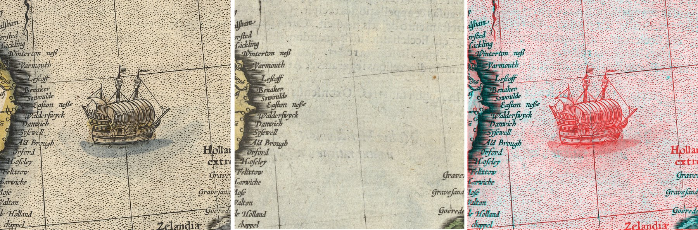
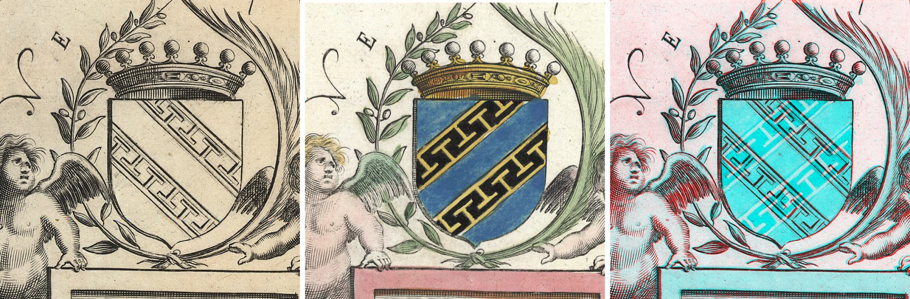
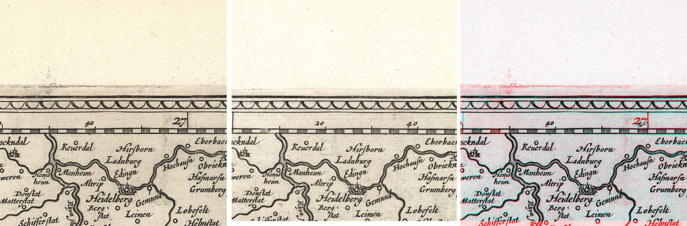
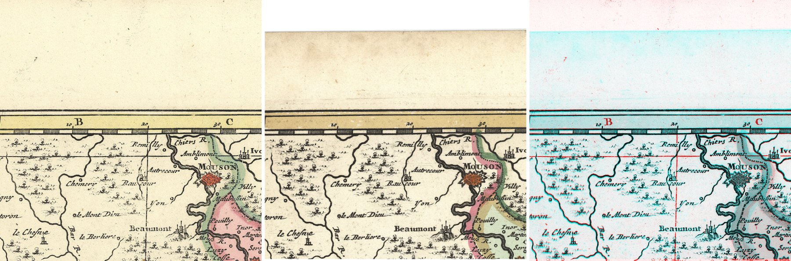

# Copperplate states

Most maps printed before about 1800 came off a hand-engraved copper plate, and a plate could stay in use for a
century. It was inherited, sold to rival publishers and **altered**: a ship added, a coat of arms re-cut, a
coordinate grid engraved, a coastline redrawn. Each altered version of a plate is a **state**. Map historians have
told states apart by eye for sixty years; the standard reference for Dutch atlases, *Koeman's Atlantes Neerlandici*
(ed. Peter van der Krogt), was built that way, copy by copy.

This repository asks whether a computer can do the same comparison, and checks the answer against van der Krogt's
own descriptions, on maps held by the [Allard Pierson](https://www.allardpierson.nl/) (University of Amsterdam).



Gerard Mercator, *Anglia regnum*, 1595. Left: HB-KZL 31.17.20. Middle: HB-KZL 31.17.19, aligned to the left.
Right: overlay — dark = ink in both, **red = ink only in the left copy**, cyan = ink only in the right. Van der Krogt
records a proof state in which the ship is missing. The comparison finds it without being told where to look.

## The test

The Allard Pierson's catalogue quotes van der Krogt's state descriptions for 24 digitised sheets, and the collection
holds at least one other impression of each. That gives **8 plates, 30 pairs of impressions**, each with an expert
description of what differs between states ([`data/pairs.json`](data/pairs.json)). A catalogue note says which
states *exist*, not which state *each copy* is, so every result below was also checked by eye.

| Plate | What van der Krogt records | Result |
|---|---|---|
| Mercator, *Anglia*, 1595 | proof state: ship missing, *Germanicvs* without ornament | **found** — both |
| Blaeu, *Hibernia*, 1634 | four ships added around Ireland in a later state | **correct "no change"** — both copies here are the first state |
| Blaeu, *Suevia*, 1630 | longitude figures re-engraved (29°20′–34°40′ vs 25°40′–31°00′) | **found** — the changed figures along the border |
| Visscher, *Lotharingia*, 1690 | with and without a coordinate grid | **found** — the grid; also a re-engraved north-east quarter that the note does not mention |
| Blaeu, *Champagne*, 1634 | bars of the coat of arms run the other way | **found** |
| Visscher, *Belgii*, 1680 | place-name list printed on the back | **correct "no change"** — the scans show only the front |
| Visscher, *Helvetia*, 1677 | with and without coordinates | **found** — the five copies split into two groups ({32.20.26, .25, .22} vs {.24, .23}); the border letter grid is in one group only |
| *Danubii fluvii pars superior*, 1690 | state 2 adds coordinates | one copy (HB-KZL 34.20.15) differs from the other four; not yet checked by eye |

**Six of six documented front-of-sheet changes found; two correct negatives.** Every pair is recognised as the same
plate. Where a family has several copies, the differences fall into consistent groups: the method sorts copies into
states without being told which is which. Full per-pair output is in [`results/`](results/).

### The other changes



Blaeu, *Champagne*, 1634, HB-KZL 32.12.03 / 32.12.02. Crown, cherubs and frame superimpose; the bars of the shield
cross in an X. Same plate, shield re-cut.



Blaeu, *Sueviae nova tabula*, 1630, HB-KZL 32.01.42 / 32.01.41. The map face is identical; the degree figures in the
border are not.



N. Visscher, *Lotharingia*, 1690, HB-KZL 31.33.21 / 31.33.18. Grid letters (B, C) and ruled grid lines are in the
left copy only.

## How it works

Two impressions of one plate never overlay exactly: paper was printed damp and shrank unevenly, copies were
hand-coloured differently, and ink density and wear vary. The method borrows from fields that already compare two
copies of one thing ([`docs/related-work.md`](docs/related-work.md)):

1. **Keep only the ink.** Watercolour and broad paint are removed; engraved line work stays. *(pathology: stain
   separation)*
2. **Align, then bend gently.** A global fit, then a smooth warp that follows the paper's shrinkage but is too stiff
   to bend around a numeral. *(stamp collecting: plating engraved stamps)*
3. **Match ink strength** using only strokes present in both copies, so a paler impression is not mistaken for a
   changed one. *(astronomy: image subtraction)*
4. **Mark ink present in one copy and absent from the other.** Wear fades a line; an alteration removes it.
   *(print inspection)*

Code: [`copperplate/compare.py`](copperplate/compare.py).

## What it cannot do yet

- **The settings were developed on eight of these thirty pairs.** This is a pilot, not a measured accuracy. The next
  step is to plant artificial alterations into identical pairs and measure the smallest change it catches.
- **Tiny marks near the border** (small numerals) are sometimes flagged when nothing changed, and coloured frame bands
  can cause false alarms.
- **The back of the sheet** is not scanned. (One copy shows its verso place-name register faintly through the paper,
  so some verso states may still be detectable.)
- **The ground truth is the catalogue's quotation of *Atlantes Neerlandici*,** not the printed volumes. Checking
  against the volumes themselves, and against van der Krogt's judgement, is the work this project proposes.

## Reproduce

Docker and `make`; nothing is installed on the host.

```sh
make image      # build the container
make fetch      # download the 24 scans from the Allard Pierson IIIF server (~860 MB)
make compare    # all 30 pairs -> results/
make figures    # the images above -> results/gallery/
make lint       # ruff
```

## Credits

Scans: Allard Pierson, University of Amsterdam, open access; fetched from their IIIF server, not redistributed here.
State descriptions: C. Koeman and P. van der Krogt, *Koeman's Atlantes Neerlandici*, as quoted in the Allard Pierson
catalogue. Code: MIT licence.
